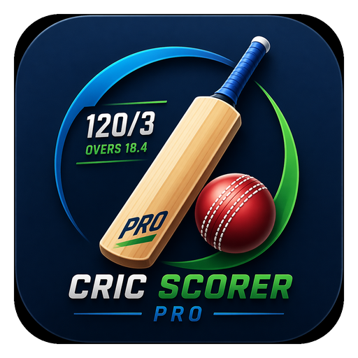

<p align="center">
  
</p>

<h1 align="center">🏏 Cric Scorer Pro</h1>
<p align="center"><b>Score every ball like a pro — a free Android app for live cricket scoring.</b></p>

<p align="center">
  <a href="LICENSE"></a>
  
  
  
  
</p>

<p align="center">
  <a href="https://github.com/Taimurx/Cric-Scorer-Pro/raw/main/cricket_pro.apk"><b>⬇️ Download APK</b></a> ·
  <a href="#-features">Features</a> ·
  <a href="#-installation">Installation</a> ·
  <a href="#-deployment">Deploy the site</a> ·
  <a href="#-enterprise-server">Enterprise Server</a> ·
  <a href="#-faq">FAQ</a>
</p>

---

## 📖 Overview

**Cric Scorer Pro** turns any phone into a complete cricket scoring desk — ball-by-ball live scoring, full scoreboards, PDF export, tournaments, and cloud sync. Built for street, club, and tournament cricket.

This repository hosts the **official landing & download website** for the app — a single-file, bilingual (EN/BN) static site — along with the **release APK (v2.0.11)** and an enterprise-grade production Node.js server, ready to deploy to Netlify, Vercel, Docker, or any cloud host.

> 🇧🇩 **বাংলায়:** ক্রিক স্কোরার প্রো একটি ফ্রি অ্যান্ড্রয়েড অ্যাপ, যা আপনার ফোনকে বানিয়ে দেয় একটি পূর্ণাঙ্গ ক্রিকেট স্কোরিং ডেস্ক — বল-বাই-বল লাইভ স্কোরিং, ফুল স্কোরবোর্ড, PDF এক্সপোর্ট, টুর্নামেন্ট ও ক্লাউড সিংক সহ। এই রিপোজিটরিতে অ্যাপের অফিসিয়াল ওয়েবসাইট, ফ্লাটার ওয়েব সংস্করণ, প্রোডাকশন সার্ভার এবং ডাউনলোডযোগ্য APK রাখা আছে।

## 📑 Table of contents

- [Features](#-features)
- [Inside the app](#-inside-the-app)
- [Download & installation](#-installation)
- [Project structure](#-project-structure)
- [Tech stack](#-tech-stack)
- [Enterprise Production Server](#-enterprise-production-server)
- [Deployment](#-deployment)
- [FAQ](#-faq)
- [License](#-license)
- [Contact](#-contact)

## ✨ Features

| | |
|---|---|
| 🏏 **Ball-by-ball scoring** | Runs, wides, no-balls, byes, leg-byes, wickets, retire, swap batsman — with one-tap undo. |
| 🧠 **Smart scoring engine** | Automatic strike rotation, legal-ball tracking, maiden-over detection. 1–90 overs per innings. |
| 📋 **Full scoreboard** | Complete batting/bowling cards, extras, match summary and result — live and post-match. |
| 📄 **PDF export** | Export the full scoreboard as a print-ready PDF and share it with teams. |
| 🏆 **Tournaments** | Knockout and league formats with super-over tiebreakers, points table and leaderboard. |
| 👥 **Team management** | Save teams and players once, reuse them across every match and tournament. |
| ☁️ **History & cloud sync** | On-device match history with resume support; optional Google sign-in for cloud backup. |
| 🎨 **3 beautiful themes** | Sunrise, Ocean and Midnight — each with light/dark modes and high-refresh display support. |

## 📱 Inside the app

- **Live scoring** — big score, big buttons, everything readable at a glance from the boundary line.
- **Full scoreboard + PDF** — complete batting/bowling cards with strike rate, export-ready.
- **Tournament leaderboard** — auto-updating points table for league and knockout formats.

## ⬇️ Installation

1. **Download the APK** — tap the download button on the [website](https://github.com/Taimurx/Cric-Scorer-Pro/raw/main/cricket_pro.apk) (53 MB).
2. **Allow installation** — open the file; if prompted, allow "Install unknown apps" for your browser.
3. **Install & open** — tap Install, then launch Cric Scorer Pro.
4. **Start scoring** — set teams, overs and toss, and score the first ball.

> 💡 Android may warn that the app is installed outside the Play Store — this is normal for direct APK downloads. Requires **Android 7.0 (Nougat) or newer**.

## 🗂️ Project structure

```
Cric-Scorer-Pro/
├── index.html            # Bilingual (EN/BN) landing page with live web demo
├── privacy.html          # Bilingual (EN/BN) Privacy Policy page
├── 404.html              # Custom branded bilingual 404 page
├── cricket_pro.apk       # Release APK (v2.0.11, ~53 MB)
├── server.js             # Enterprise Node.js HTTP server (HTTP 206 range, Gzip, ETags, Security)
├── package.json          # NPM configuration and automated test scripts
├── Dockerfile            # Production Docker image with non-root user and healthcheck
├── docker-compose.yml    # Docker Compose for local or cloud orchestrations
├── test/
│   └── server.test.js    # Automated test suite (100% pass)
├── web/                  # Complete Flutter Web App build (Canvaskit, WASM, PWA)
├── sitemap.xml           # SEO Sitemap
├── robots.txt            # Search engine crawler policies
├── netlify.toml          # Netlify config with security and cache headers
├── vercel.json           # Vercel config with security, cache headers and clean rewrites
├── DEPLOY.md             # Complete deployment guide (Bengali & English)
└── LICENSE               # All Rights Reserved
```

## 🛠️ Tech stack

- **Landing Page** — semantic HTML5, modern CSS3 custom properties, zero build step.
- **Flutter Web App** — Canvaskit / WebAssembly renderer with Google Identity Services cloud backup.
- **Production Server** — Node.js native engine with HTTP 206 Byte-Range streaming for reliable 54MB APK downloads, Gzip/Deflate compression, ETags, and enterprise security headers.
- **App** — distributed here as signed release APK (`cricket_pro.apk`, v2.0.11).

## 🚀 Enterprise Production Server

Run the production server with Node.js or Docker:

```bash
# Start server
npm start

# Run automated tests
npm test

# Run with Docker
docker compose up -d
```

Key Endpoints:
- `http://localhost:3000/` — Main landing page
- `http://localhost:3000/web/` — Flutter Web application
- `http://localhost:3000/download` — Direct APK download (HTTP 206 Byte Range support)
- `http://localhost:3000/healthz` — Container health check telemetry

## ❓ FAQ

<details>
<summary>Is the app free?</summary>
<br>Yes — Cric Scorer Pro is completely free to download and use.
</details>

<details>
<summary>Does it work offline?</summary>
<br>Yes. Scoring, history and tournaments all work fully offline — data is stored on your phone. Cloud sync is optional and only needs internet for Google sign-in.
</details>

<details>
<summary>What if I close the app mid-match?</summary>
<br>Nothing is lost. Every ball is saved instantly — reopening the app offers to resume your unfinished match exactly where you left off.
</details>

<details>
<summary>Can I run a full tournament?</summary>
<br>Yes — knockout or league tournaments, with super-over tiebreakers, an automatic points table and a leaderboard.
</details>

## 📄 License

© 2026 Taimur ShakiB. All Rights Reserved.

This project is proprietary — see [LICENSE](LICENSE) for terms. The app is free to download and use in its distributed form (the APK); the source code is not licensed for reuse, modification, or redistribution without written permission.

## 📬 Contact

**Taimur ShakiB** — [github.com/Taimurx](https://github.com/Taimurx)

<p align="center">Made with ❤️ for cricket.</p>
